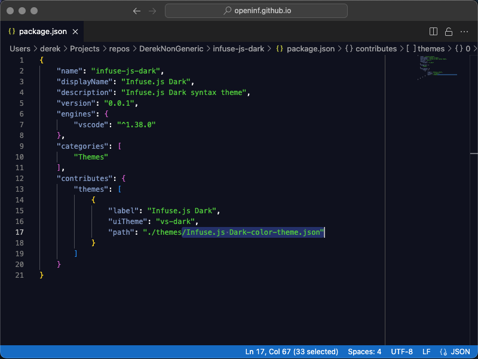

# Infuse.js Dark

> Infuse.js Dark syntax theme

[](./demo.png)

## Installation

On macOS, all one has to do is clone this repo into the VS Code extensions directory.

Cmd + P to open the command palette, then go to color themes, and it should show up.

On both macOS and Windows, this is located in the hidden `.vscode` folder in user home:

```console
~/.vscode/extensions
```

On Windows, the theme will not show up in the color themes drop-down until it has been both:
cloned into the extensions directory _and_ installed via the command palette option of:
"Developer: Install Extensions from Location" and then had its folder selected.

**Enjoy!**

<small>This is the README for VS Code extension: "infuse-js-dark".</small>

<small>This syntax theme was originally inspired by [Blackboard][];
however, a significant amount of modifications we made to it. Among those
modifications include representing the color palette in an entirely new format.</small>

[Blackboard]: https://codemirror.net/5/demo/theme.html#blackboard
